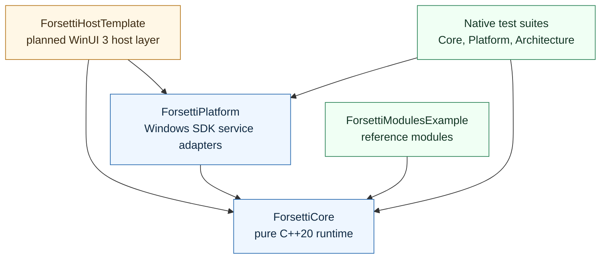
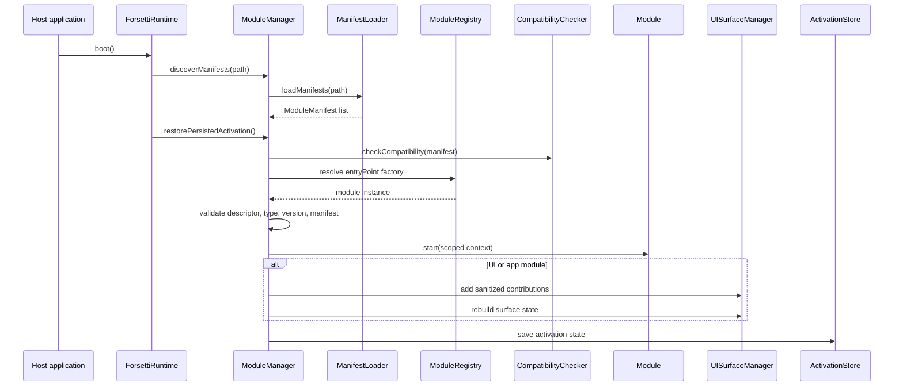

# Forsetti Framework - Windows

Forsetti Framework - Windows is a proprietary modular runtime framework for Windows 11 applications. It is built with C++20, MSVC, CMake, vcpkg, and native Windows SDK service adapters.

The framework centers on a compatibility-governed module model: modules declare identity, platform support, capabilities, entitlement requirements, and optional UI contributions. The runtime validates those declarations before activation, scopes module access to approved services, and keeps UI surface state under framework control.

The WinUI 3 host application template is planned and is not yet a repository target. Current repository targets build the core runtime, Windows platform adapters, example modules, and native test suites.

## What Forsetti Provides

| Area | Repository Contract |
|---|---|
| Module lifecycle | Manifest discovery, compatibility validation, entitlement checks, activation, deactivation, and restore diagnostics |
| Service modules | Multiple service modules can run concurrently |
| UI/app modules | UI and app modules share one active surface slot |
| Capability governance | Runtime service access and UI contribution features are scoped to declared capabilities |
| Module communication | Module-to-module messages are framework-mediated and source identity is assigned by scoped context |
| UI composition | Toolbar items, view injections, and overlay schemas are contributed by the active UI/app module |
| Platform services | WinHTTP networking, Registry storage, DPAPI secure storage, constrained local file export, and no-op telemetry |
| Guardrails | Local scripts verify build, tests, dependency boundaries, manifests, compatibility checks, and script regressions |

## Architecture At A Glance



The hard dependency rule is one-way only:

- `ForsettiCore` depends on nothing in the repository.
- `ForsettiPlatform` depends on `ForsettiCore`.
- `ForsettiModulesExample` depends on `ForsettiCore`.
- The planned `ForsettiHostTemplate` will depend on `ForsettiCore` and `ForsettiPlatform`.
- Reverse and lateral includes are blocked by tests and scripts.

## Runtime Flow



Activation fails before `start()` when compatibility, entitlement, capability, or factory identity checks fail. UI/app activation preserves the single active surface slot and cleans up the previous active UI/app module.

## Repository Layout

| Path | Purpose |
|---|---|
| `include/ForsettiCore` | Public runtime, module, manifest, event, service, capability, and UI surface contracts |
| `src/ForsettiCore` | Core runtime implementation with no platform dependencies |
| `include/ForsettiPlatform` | Public Windows platform adapter contracts |
| `src/ForsettiPlatform` | Windows SDK implementations for networking, storage, secure storage, file export, and telemetry |
| `src/ForsettiModulesExample` | Reference service/UI modules and manifest resources |
| `tests` | Native CppUnitTest suites surfaced through CTest |
| `Scripts` | Local guardrail, compatibility, manifest, dependency, and discussion automation scripts |
| `.github` | Pull request template, label/release metadata, discussion automation config, and remote marker workflow |
| `docs/governance` | Repository-grounded governance and discussion automation documents |
| `.forsetti/remediation` | Phase evidence and acceptance reports for the completed remediation sequence |

## Build And Test

### Prerequisites

- Windows 11
- Visual Studio 2022 with the Desktop development with C++ workload
- CMake 3.28 or newer
- vcpkg with `VCPKG_ROOT` set
- PowerShell 7 or Windows PowerShell

### Configure, Build, And Test

```powershell
cmake --preset debug
cmake --build --preset debug
ctest --preset debug --output-on-failure
```

The repository currently defines `debug` and `release` CMake presets. The package-level `windows-msvc-debug` name is not a repository preset.

### Full Local Guardrail Wrapper

Run this before opening a pull request:

```powershell
.\Scripts\verify-forsetti-guardrails.ps1
```

The wrapper performs:

1. CMake configure with the `debug` preset.
2. CMake build with the `debug` preset.
3. CTest execution.
4. Architecture checks.
5. Dependency checks.
6. Manifest validation.
7. Pull request compatibility checks.
8. Script regression tests.

## Module Manifest Baseline

Manifests live under `ForsettiManifests` directories and use JSON with exact platform/capability casing:

```json
{
  "schemaVersion": "1.0",
  "moduleID": "com.forsetti.module.example-service",
  "displayName": "Example Service",
  "moduleVersion": { "major": 0, "minor": 1, "patch": 0, "prerelease": null },
  "moduleType": "service",
  "supportedPlatforms": ["Windows"],
  "minForsettiVersion": { "major": 0, "minor": 1, "patch": 0, "prerelease": null },
  "maxForsettiVersion": null,
  "capabilitiesRequested": ["storage", "telemetry"],
  "iapProductID": null,
  "entryPoint": "ExampleServiceModule"
}
```

Supported module types are `service`, `ui`, and `app`. Supported capabilities are:

- `networking`
- `storage`
- `secure_storage`
- `file_export`
- `telemetry`
- `routing_overlay`
- `toolbar_items`
- `view_injection`
- `ui_theme_mask`
- `event_publishing`

`ui_theme_mask` remains reserved for framework-owned presentation policy.

## Documentation Map

Repository documents:

- `README.md` - primary repository entry point.
- `CHANGELOG.md` - release and notable change history.
- `CONTRIBUTING.md` - contributor workflow and verification expectations.
- `wiki.md` - tracked index for the public GitHub Wiki.
- `docs/governance/github_automation_agents.md` - discussion automation design.
- `docs/governance/discussion_moderation_policy.md` - discussion moderation policy.
- `agentic-coding-policy.json` - machine-readable coding policy and invariants.
- `forsetti-instructions.json` - machine-readable framework architecture and API summary.

Public Wiki:

- [Forsetti Framework - Windows Wiki](https://github.com/flynn33/Forsetti-Framework-Windows/wiki)

The Wiki contains detailed pages for architecture, runtime lifecycle, module manifests, capabilities, UI surface behavior, platform services, build/test guardrails, governance, API reference, and roadmap decisions.

## Current Acceptance Status

The remediation sequence has completed through final acceptance. Local Windows/MSVC validation passed with the `debug` preset, all three CTest suites passed, repository guardrails passed, and all phase evidence files are present under `.forsetti/remediation`.

Remaining owner decisions are tracked in the final acceptance report, including remote build/test parity restoration, vcpkg baseline pinning, planned host-template implementation, theme policy exposure, and general module-originated event publishing.

## Patent Notice

The architecture and design of Forsetti are the subject of a pending U.S. patent application:
**Compatibility-Governed, Entitlement-Aware Modular Runtime Framework for Native Application Modules** - U.S. Application No. 63/999,606, filed March 8, 2026. Patent Pending.

## License

Proprietary. Copyright (c) 2026 James Daley. All Rights Reserved.
