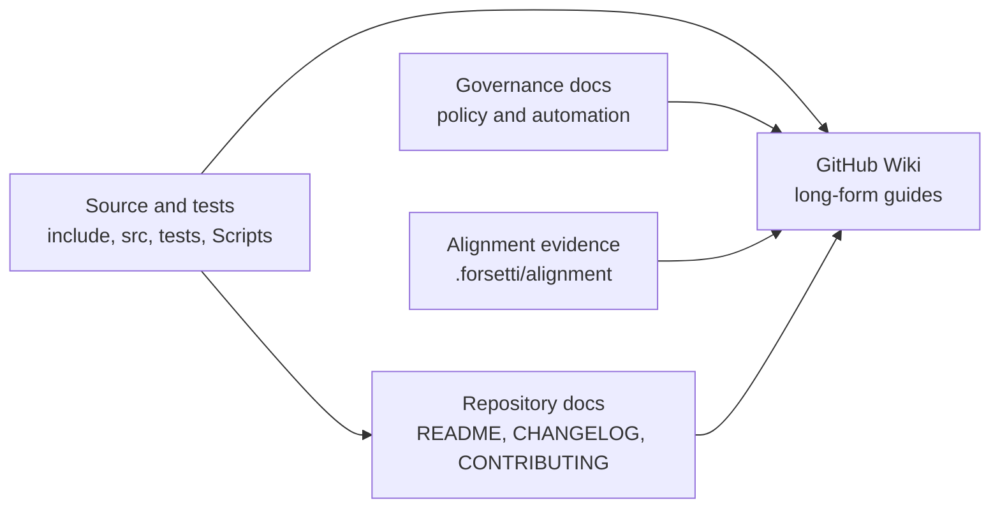

# Forsetti Framework - Windows Wiki Index

This file is the repository-tracked companion to the public GitHub Wiki:

https://github.com/flynn33/Forsetti-Framework-Windows/wiki

The Wiki is the long-form documentation surface for architecture, runtime behavior, module authoring, validation, and governance. Repository documents should remain concise and point readers to the Wiki for deep explanations and diagrams.

## Wiki Page Set

| Page | Purpose |
|---|---|
| `Home` | Orientation, status, page map, and high-level diagrams |
| `Architecture` | Layering rules, component graph, dependency boundaries, and repository layout |
| `Runtime-Lifecycle` | Boot, discovery, registration confirmation, activation, deactivation, restore, and entitlement reconciliation |
| `Module-System` | Module types, schema 1.1 manifests, runtime requirements, registry factories, compatibility, and examples |
| `Capabilities-and-Security` | Capability policy, scoped service access, default roles, messaging rules, and reserved namespaces |
| `UI-Surface-Model` | UI/app activation, declared UI IDs, toolbar items, view injections, overlays, and theme mask policy |
| `Platform-Services` | WinHTTP, Registry, DPAPI, local file export, telemetry, registration persistence, digesting, and view factories |
| `Build-and-Testing` | Prerequisites, CMake presets, CTest, guardrail scripts, hosted checks, and validation blockers |
| `API-Reference` | Public headers, interfaces, value types, enums, platform services, and host template contracts |
| `Coding-Policy` | Engineering rules, dependency invariants, style expectations, and verification policy |
| `Governance-and-Operations` | Repository automation, discussion routing, moderation, PR workflow, and evidence policy |
| `Roadmap-and-Risks` | Native validation blockers, remote workflow restoration, dependency pinning, and future hardening |

## Documentation Architecture



## Update Rules

- Update `README.md` when onboarding, build, validation, architecture, or release status changes.
- Update `CHANGELOG.md` for notable runtime, validation, governance, or documentation changes.
- Update Wiki pages when behavior needs explanation, diagrams, or examples beyond the README.
- Update `docs/governance` when repository automation, discussion routing, moderation, or owner-facing policy changes.
- Keep `framework-policy.json` and `implementation-policy.json` aligned with the source and public docs.

## Current Status

Runtime-boundary alignment is merged into `main`, and evidence is tracked under `.forsetti/alignment`. The canonical Windows validation path is:

```powershell
.\Scripts\verify-forsetti-guardrails.ps1
```

The wrapper configures, builds, runs CTest, checks architecture and dependency boundaries, validates manifests, runs pull request compatibility checks, and runs script regression tests. Native Debug/Release validation remains blocked until it is run on Windows/MSVC with CMake, CTest, PowerShell, and `VCPKG_ROOT` available.
